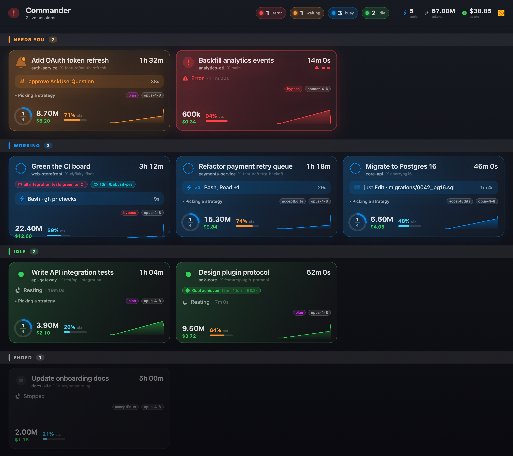

# agent-status

A native macOS menu bar app that tells you what your AI coding agents are doing — right now. It tails the on-disk state Claude Code (and, soon, Codex) writes locally and surfaces the things you actually care about: which tool is running, the cumulative token spend, the permission mode, and whether anything is blocked waiting for your input. Zero network calls. ~15 MB RAM, 0 % CPU idle.

 



<sub>The optional fullscreen **Commander board**: sessions grouped by urgency (Needs you / Working / Idle / Ended), each card showing the live tool, task progress, context-window gauge, tokens & cost. (Synthetic data.)</sub>


## Features

- **At-a-glance menu bar** — aggregate icon morphs by dominant status (idle / busy / waiting / error).
- **Per-session menu-bar items** — pin specific sessions to the menu bar with an informative two-line label: aiTitle on top, state-driven suffix below (`Bash xcodebuild test · 1m` for single-tool busy, `Bash, Read, Agent · 2m` for multi-tool, `approve Bash · xcodebuild test` when waiting on approval). N concurrent tools render as N small dots in the icon column. A red pip appears on the icon when any of the last 5 completed tools errored. Idle / stopped / paused sessions render single-line — the icon alone carries the status. Designed to answer "do I need to look at this session" without a click.
- **Rich dashboard** (click the aggregate icon) — for every live session: animated status indicator, **currently-running tool with live duration** ("Bash: `xcodebuild …` (47s)"), permission-mode chip (auto / plan / bypass), tokens & estimated USD cost, model chip, AI-generated session title, 60 s activity sparkline.
- **Commander board** (fullscreen, optional) — a dark control-room view of every session, grouped by urgency (Needs you / Working / Idle / Ended). Each card shows the live tool (or "Thinking…"), concurrency badge (`×3`), current task + k/n progress ring, git branch, model & permission-mode chips (bypass reads red), cumulative tokens & cost, and a **context-window gauge** (% of the model's window in use — your early warning before auto-compaction). Idle and errored cards show how long they've been sitting. Click a card for inline detail: per-category token split, exact context fill, waiting-approval banner with question options, recent tool results with durations, turns/tools/error counts. Subagent (sidechain) API calls are counted into session spend, priced at their own model.
- **Per-session detail popover** (click any per-session item) — full token split (input / output / cache_read / cache_write), last user prompt, last assistant reply, sub-agent activity, error count, full metadata.
- **Concurrency-aware** — the per-session popover lists every in-flight tool with live elapsed timers, recent completions with durations, and tool-aware "waiting for approval" detail when blocked on a permission gate.
- **Native notifications** — three independently toggleable triggers: `waiting > 30 s`, `tool error`, `long task completed`.
- **Always-on** — optional LaunchAgent installer for autostart at login.
- **Pluggable providers** — `SessionProvider` protocol; Claude Code ships today, Codex stub already wired.

## Install

### Build from source

Prerequisites:

- macOS 14 (Sonoma) or later
- Xcode 16+ (Swift 6, strict concurrency)
- [`xcodegen`](https://github.com/yonaskolb/XcodeGen) — `brew install xcodegen`

```bash
git clone https://github.com/DeeAutonomous/agent-status.git
cd agent-status
xcodegen generate
xcodebuild -project AgentStatus.xcodeproj -scheme AgentStatus -configuration Release \
           -derivedDataPath build \
           CODE_SIGN_IDENTITY=- CODE_SIGNING_REQUIRED=NO CODE_SIGNING_ALLOWED=NO build
codesign --force --deep --sign - build/Build/Products/Release/AgentStatus.app
ditto build/Build/Products/Release/AgentStatus.app /Applications/AgentStatus.app
open /Applications/AgentStatus.app
```

To run on every login: open the app, click the gear in the dropdown footer, and **Install** the LaunchAgent. It writes `~/Library/LaunchAgents/ai.autonomous.agent-status.plist` and registers the service with `launchctl bootstrap`. The agent uses `KeepAlive=true`, so use **Quit and Disable** in Settings to stop it permanently.

### Releases

Pre-built signed `.app` bundles will be attached to GitHub releases starting at v0.1.0. *(Coming soon.)*

## Supported providers

| Provider | Status | Data source |
|---|---|---|
| **Claude Code** | ✅ shipping | `~/.claude/sessions/<pid>.json` + `~/.claude/projects/<encoded-cwd>/<sessionId>.jsonl` |
| **Codex** | 🚧 stub registered (no data yet) | TBD |

Adding a new agent is one new file: implement `SessionProvider` (`start()` / `stop()` + `AsyncStream<[SessionSnapshot]>`) and `ProviderRegistry.register(...)`. Every other layer — store, dashboard, per-session menu bar items, notifications, sparklines — handles multiple providers already.

## How session discovery works

Two ingest layers feed a single `@MainActor SessionStore`:

1. **Coarse status** — `~/.claude/sessions/<pid>.json` carries the basic `status` field (`idle` / `busy` / `waiting` / `running` / `paused` / `stopped` / `error`) plus a free-text `waitingFor` reason. Watched via `DispatchSourceFileSystemObject` (catches new / removed files instantly) **and** a 750 ms polling loop (catches in-place rewrites that don't bubble up to directory vnode events). Dead PIDs are filtered with `kill(pid, 0)`.

2. **Rich state** — `~/.claude/projects/<encoded-cwd>/<sessionId>.jsonl` is the per-message transcript. A per-session `TranscriptTailer` tracks a byte offset, reads only new bytes on each 1 Hz tick, parses JSONL incrementally, and derives: current tool with input preview & duration, cumulative tokens, estimated USD cost (per `ModelPricing.swift`), current model, last `stop_reason`, `permission-mode`, AI-generated title, last user prompt, last assistant text, sub-agent activity, and error count.

```
ClaudeCodeProvider ─┐
                    ├─► ProviderRegistry ─► SessionStore (@MainActor, @Published)
CodexProvider stub ─┘                              │
                                                   ├─► AggregateMenuBarLabel    (SwiftUI MenuBarExtra label)
                                                   ├─► DashboardView            (SwiftUI .window popover)
                                                   ├─► PerSessionItemController (imperative NSStatusItems)
                                                   └─► NotificationManager      (waiting / error / completion)
```

`SessionStore.ingest` uses a UI-relevant equality check that ignores `updatedAt` — without it, the 1.3 Hz poll would thrash every subscriber even when nothing meaningful changed. Per-session popover content is built lazily and torn down on close (`NSPopoverDelegate.popoverDidClose`), so `repeatForever` animations and per-second timers only run while a popover is actually visible.

## Privacy

**agent-status is fully local.** It reads only files under `~/.claude/`:

- `~/.claude/sessions/<pid>.json`
- `~/.claude/projects/<encoded-cwd>/<sessionId>.jsonl`

It makes **no network calls** of any kind — no telemetry, no analytics, no auto-update check, no remote configuration, no cloud sync. The bundle ships with the App Sandbox **off** so it can read those paths from your real home directory; in exchange the things the sandbox would otherwise *allow* over the network are simply unused.

Verify it yourself:

```bash
lsof -p $(pgrep AgentStatus) -i 2>/dev/null
# (no output)
```

The estimated-cost figures are computed locally from token counts × per-model rates hard-coded in `AgentStatus/Model/ModelPricing.swift` — update those if Anthropic publishes new pricing.

## Status & roadmap

- **v0.1.0** — current
- ✅ Phase A — transcript tailer + `EnrichedSession` model
- ✅ Phase B — rich signals surfaced in dashboard + detail popover
- ✅ Phase C — native notifications
- 🚧 Real Codex provider once the data source surfaces
- 🚧 First-class headless `claude -p` (`sdk-cli`) sessions — they render as "unknown" with no permission chip today, because pid.json carries no `status` field for headless and the transcript omits `permission-mode` records; plan is to synthesize coarse status from `EnrichedSession.currentTool` + `lastStopReason`, read `--permission-mode` from the process argv, and tag the row to distinguish headless from interactive
- 🚧 GitHub releases with pre-built bundles
- 🚧 End-to-end test for the `TranscriptTailer` against a fixture transcript

## Project layout

```
AgentStatus/
├── App/                    # @main app, AppDelegate, DI container
├── Model/                  # SessionSnapshot, SessionStatus, EnrichedSession, TokenUsage, ModelPricing, ...
├── Providers/              # SessionProvider protocol + ClaudeCode + Codex stub
├── Watching/               # DirectoryWatcher, TranscriptTailer, HistoryBuffer, PIDLiveness
├── Store/                  # SessionStore (@MainActor), Settings
├── UI/MenuBar/             # AggregateMenuBarLabel, DashboardView, SessionRow, sparkline, status icons
├── UI/PerSession/          # PerSessionItemController, PerSessionStatusItem, SessionDetailView
├── UI/Settings/            # SettingsView
├── UI/                     # NotificationManager
├── LaunchAgent/            # Installer + plist payload builder
└── Util/                   # Debouncer, ElapsedFormatter, Log
AgentStatusTests/           # XCTest target — 78 tests
```

## Contributing

PRs welcome. Run `xcodegen generate && xcodebuild test ...` before sending.

## License

[Apache-2.0](LICENSE).

---

© 2026 Autonomous, Inc.
